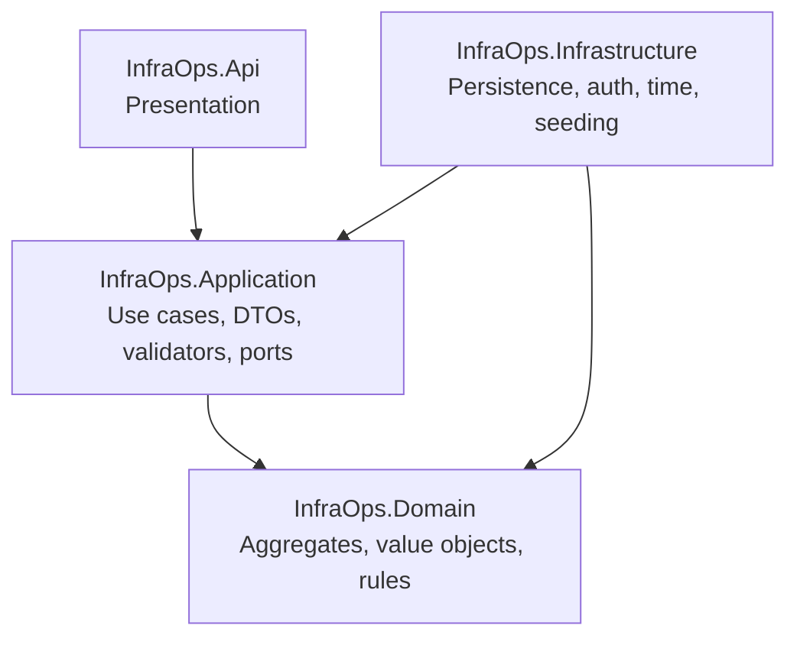
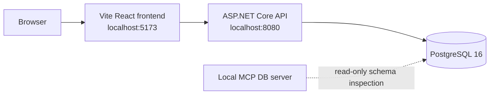

# InfraOps Architecture

InfraOps is implemented as a modular monolith with Clean Architecture boundaries. The goal is to keep the operational domain testable and stable while allowing infrastructure concerns such as EF Core, JWT, PostgreSQL, and HTTP controllers to change independently.

## Layer Direction

Dependencies point inward. Controllers map HTTP concerns and delegate to Application handlers. Application defines repository ports and use-case contracts. Infrastructure implements those ports with EF Core and other adapters. Domain has no dependency on EF Core, ASP.NET Core, or frontend concerns.

## Bounded Contexts

- Identity and Access: users, roles, permissions, JWT, refresh tokens.
- Entity Types: configurable entity definitions and dynamic field metadata.
- Inventory: operational assets with fixed metadata plus dynamic attributes.
- Preventive Templates: entity-type-specific checklist definitions.
- Preventive Executions: technician workflow, execution snapshots, answers, draft/submitted lifecycle.
- Preventive Validations: validator decisions, status transitions, validation history.
- Dashboard: read-only operational projections over inventory, execution, and validation data.

## Why A Modular Monolith

The MVP has tightly related workflows and a small operational footprint. A modular monolith gives clear boundaries and testable use cases without the cost of service discovery, distributed transactions, message brokers, or cross-service observability. Future extraction remains possible because application ports isolate persistence and external adapters.

## Dashboard Query Design

Dashboard reporting is implemented as Application queries backed by an Infrastructure repository. The API exposes read-only endpoints, but aggregation logic remains outside controllers. EF Core queries use projection and grouping to avoid loading full aggregates for reporting.

## Deployment Topology

The local development workflow is Docker-first and runs frontend, API, and PostgreSQL through Docker Compose.
