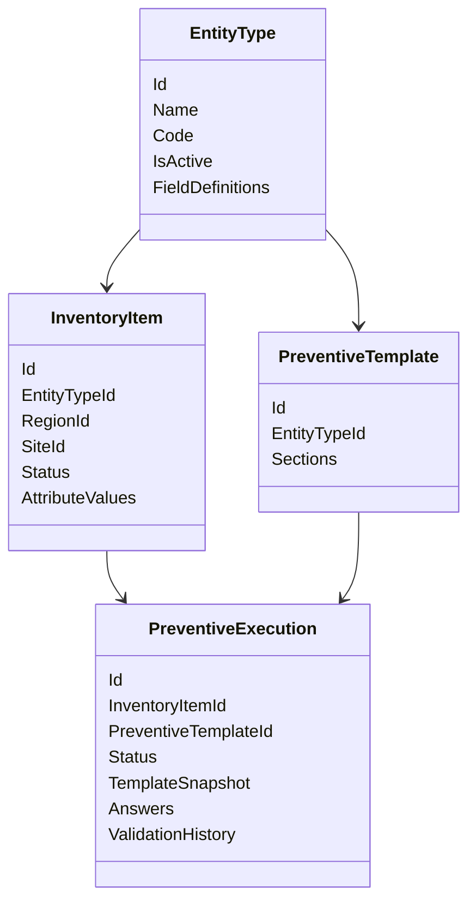

# Domain Model

InfraOps separates fixed operational concepts from configurable infrastructure definitions.

## Fixed Core

- User, Role, Permission
- Region, Site
- Inventory Item lifecycle metadata
- Preventive Execution statuses
- Preventive Validation statuses and audit records

## Configurable Layer

- Entity Type
- Entity Field Definition
- Entity Field Option
- Preventive Template
- Preventive Section
- Preventive Checklist Item
- Preventive Checklist Option

## Key Aggregate Boundaries

## Dynamic Entity System

Entity Types let administrators define inventory forms without code changes. Inventory Items store fixed operational metadata and dynamic attribute values validated against the active field definitions for the selected Entity Type.

This gives the product a stable operational core while allowing UPS, Generator, HVAC, and future asset categories to be configured through data.

## Execution Snapshot Strategy

Preventive Executions store their own template snapshot: section titles, checklist labels, item types, required flags, numeric bounds, select options, and failure-comment rules. This intentionally duplicates selected template metadata at execution time.

The tradeoff is extra storage for historical safety. Submitted executions retain their original meaning even if an administrator later edits the Preventive Template.

## Validation History

Validation decisions are appended as records on the Preventive Execution aggregate. The aggregate owns the status transition and the audit record together, preventing a validation state change without corresponding history.
