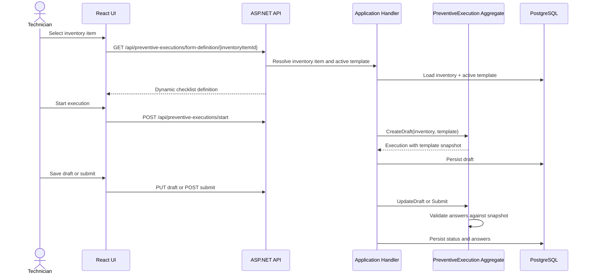
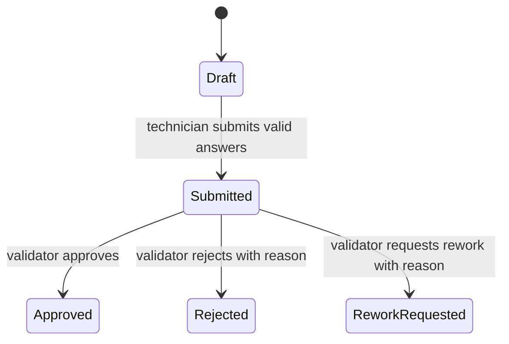

# Preventive Execution And Validation Flow

This document describes the operational workflow from inventory item selection through validation.

## Execution Flow

## Validation Flow

Invalid transitions are blocked by the aggregate:

- Draft cannot be approved, rejected, or sent to rework.
- Approved cannot be approved again.
- Rejected cannot be approved without a future explicit rework flow.
- ReworkRequested cannot be approved without a future resubmission flow.

## Audit Visibility

Execution detail and validation review screens expose:

- created by and created timestamp
- updated by and updated timestamp
- submitted by and submitted timestamp
- validation history with validator, action, timestamp, and comment or reason

## Dashboard Reuse

The dashboard consumes the same persisted operational facts:

- inventory item counts by active state and entity type
- preventive execution counts by status and month
- validation outcome counts by status
- submitted executions pending validator review

No dashboard endpoint mutates workflow state.
